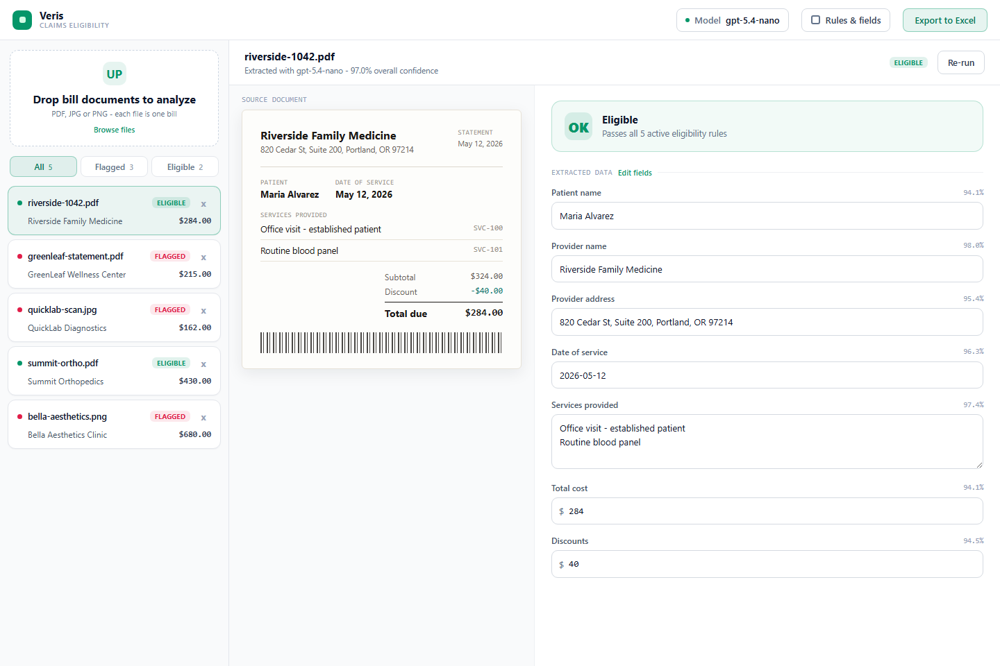
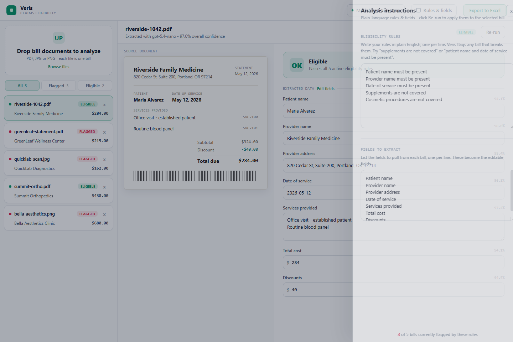

# Veris Claims Eligibility

OpenAI-backed implementation of the medical bill eligibility analyzer handoff. The app lets a reviewer load one or more bill documents, extract claim fields with an OpenAI model, edit extracted values, tune plain-English eligibility rules, and export a CSV that opens cleanly in Excel.

## Screenshots





## Run locally
1. Open PowerShell.
2. Go to the project directory:

   ```powershell
   cd "C:\Users\nafer\github repo\Veris Claims Eligibility"
   ```

3. Install dependencies:

   ```powershell
   npm install
   ```

4. Start the backend:

   ```powershell
   npm start
   ```

5. Open this URL in your browser:

   ```text
   http://localhost:4173
   ```

The backend reads OpenAI settings from `.env`. Keep `.env` local; it is ignored by git.

Use this shape for the model menu:

```text
OPENAI_API_KEY=your-secret-key
OPENAI_MODEL=gpt-5.4-nano
OPENAI_MODEL_OPTIONS=gpt-5.5|Highest accuracy - slower;gpt-5.4-mini|Fast - high accuracy;gpt-5.4-nano|Lowest cost - fastest
```

Each model option is `model-id|Description`, and options are separated with semicolons. The UI displays the model ID as the label. `OPENAI_MODEL` must match one of the option IDs to choose the default selected model.

## Included behavior

- Server-side OpenAI extraction using the configured `.env` model.
- Drag/drop and file picker support for PDF, JPG, and PNG bill documents.
- Each uploaded file is analyzed as a separate bill document.
- Multi-page PDFs can be reviewed in the source document panel.
- Editable extracted fields with missing-required-field highlighting.
- Plain-English rule parser for required fields and excluded service categories.
- Flagged/eligible filters.
- CSV export named `eligibility-results.csv`.

## License

MIT. See [LICENSE](LICENSE).
